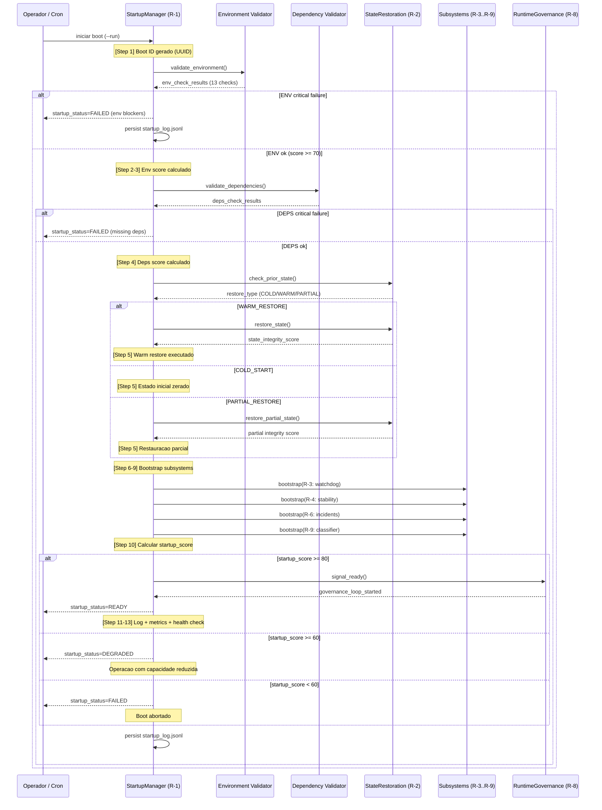

# Autonomous Startup Flow — Phase R

> Document: `ai/docs/autonomous_startup_flow.md`
> Phase: R — Autonomous Runtime Governance & Production Hardening
> Module: R-1 AutonomousStartupManager
> Updated: 2026-05-17

---

## Visao Geral

O `AutonomousStartupManager` (R-1) orquestra o boot completo do sistema em 13 passos
sequenciais. Cada passo tem criterios de sucesso definidos, e qualquer falha em passo
BLOCKING eleva o score de penalidade. O resultado e um `startup_score` que determina
o `startup_status`: `READY`, `DEGRADED` ou `FAILED`.

**Regra fundamental:** se `startup_status = FAILED`, o sistema nao inicia.
Operadores devem corrigir o ambiente antes de tentar novamente.

---

## 1. Sequencia de Startup Completa



---

## 2. Os 13 Passos do Boot

| Passo | Nome | BLOCKING | Descricao | Falha Result |
|---|---|---|---|---|
| 1 | `generate_boot_id` | Nao | Gera UUID para rastreabilidade do boot | — |
| 2 | `validate_environment` | **Sim** | Valida 13 variaveis e configs de ambiente | `startup_status=FAILED` |
| 3 | `compute_env_score` | Nao | Calcula `env_validation_score` ponderado | Penalidade no score |
| 4 | `validate_dependencies` | **Sim** | Verifica modulos Python e servicos externos | `startup_status=FAILED` |
| 5 | `restore_or_initialize_state` | Nao | Detecta tipo de restore e executa R-2 | `COLD_START` fallback |
| 6 | `bootstrap_watchdog` | Nao | Inicializa R-3 com lista de servicos | Penalidade no score |
| 7 | `bootstrap_stability_engine` | Nao | Inicializa R-4 com baseline de sessao | Penalidade no score |
| 8 | `bootstrap_incident_manager` | **Sim** | Inicializa R-6 (critico para operacao) | `startup_status=FAILED` |
| 9 | `bootstrap_readiness_classifier` | Nao | Inicializa R-9 para classificacao | Penalidade no score |
| 10 | `compute_startup_score` | N/A | Agrega todos os sub-scores com pesos | Resultado final |
| 11 | `persist_startup_log` | Nao | Salva em `data/startup_log.jsonl` | Warning apenas |
| 12 | `emit_prometheus_metrics` | Nao | Emite metricas R-10 se disponivel | Warning apenas |
| 13 | `signal_governance` | Nao | Notifica R-8 para iniciar loop | Governance inicia lazy |

---

## 3. Checklist de Validacao de Ambiente (13 Checks)

| # | Check | Variavel / Recurso | Tipo | Blocker |
|---|---|---|---|---|
| 1 | `BOT_AUTO_START` presente e `false` | `BOT_AUTO_START` | EnvVar | **Sim** |
| 2 | `TRADING_MODE` definido | `TRADING_MODE` | EnvVar | **Sim** |
| 3 | `ALLOW_LIVE_AUTO_ACTIVATION` = `false` | `ALLOW_LIVE_AUTO_ACTIVATION` | EnvVar | **Sim** |
| 4 | `REQUIRE_MANUAL_LIVE_CONFIRMATION` = `true` | `REQUIRE_MANUAL_LIVE_CONFIRMATION` | EnvVar | **Sim** |
| 5 | `DATA_DIR` existe e e gravavel | `DATA_DIR` | FileSystem | **Sim** |
| 6 | `LOG_DIR` existe ou pode ser criado | `LOG_DIR` | FileSystem | Nao |
| 7 | `DATABASE_URL` ou `DB_PATH` configurado | `DATABASE_URL` | EnvVar | **Sim** |
| 8 | Python >= 3.9 | runtime | Python | **Sim** |
| 9 | Modulos criticos importaveis | `fastapi`, `pydantic`, etc. | Python | **Sim** |
| 10 | `PROMETHEUS_PORT` livre (se configurado) | porta TCP | Network | Nao |
| 11 | Disco disponivel >= 500 MB em `DATA_DIR` | filesystem | Storage | Nao |
| 12 | `TZ` ou timezone configurado | `TZ` | EnvVar | Nao |
| 13 | `SECRET_KEY` ou `JWT_SECRET` presentes | secrets | EnvVar | **Sim** (se modo live) |

**Checks 1-4 sao invariantes de seguranca:** falha neles eleva imediatamente o score de risco
e e sempre BLOCKING independentemente de outros resultados.

---

## 4. Variaveis de Ambiente Criticas

| Variavel | Valor Obrigatorio | Proposito |
|---|---|---|
| `BOT_AUTO_START` | `false` | Impede auto-start em live sem intervencao manual |
| `TRADING_MODE` | `paper` / `live_micro` / `live` | Define modo operacional corrente |
| `ALLOW_LIVE_AUTO_ACTIVATION` | `false` | Garantia hard de que live nao e auto-ativado |
| `REQUIRE_MANUAL_LIVE_CONFIRMATION` | `true` | Exige confirmacao manual para qualquer transicao live |
| `DATA_DIR` | path valido | Diretorio base para todos os JSONL e estados |
| `DATABASE_URL` | connection string | Banco de dados operacional |
| `SECRET_KEY` | string aleatoria >= 32 chars | Autenticacao JWT (obrigatorio se modo live) |

**Regra:** `ALLOW_LIVE_AUTO_ACTIVATION` e `REQUIRE_MANUAL_LIVE_CONFIRMATION` nao
podem ser sobrescritos por nenhum modulo autonomo. Sao lidos apenas na inicializacao
e tratados como constantes imutaveis durante a sessao.

---

## 5. Decision Tree: startup_recovery_state

```
boot iniciado
      │
      ▼
data/operational_state.json existe?
      │
      ├── NAO ──────────────────────────────→ COLD_START
      │                                        (estado zerado, sem historico)
      │
      └── SIM
            │
            ▼
         checksum valido?
            │
            ├── NAO ──────────────────────→ PARTIAL_RESTORE
            │                               (estado carregado com ressalvas)
            │                               state_integrity_score < 80
            │
            └── SIM
                  │
                  ▼
               todos os campos obrigatorios presentes?
                  │
                  ├── NAO ──────────────→ PARTIAL_RESTORE
                  │                       (campos faltando = estado incompleto)
                  │
                  └── SIM
                        │
                        ▼
                     timestamp do estado <= 24h atras?
                        │
                        ├── NAO ──────→ COLD_START com aviso
                        │               (estado muito antigo descartado)
                        │
                        └── SIM ─────→ WARM_RESTORE
                                        (restauracao completa)
                                        state_integrity_score >= 80
```

---

## 6. Score Thresholds de Startup

### Formula do startup_score

```
startup_score =
  env_validation_score   × 0.30
  deps_validation_score  × 0.25
  subsystem_bootstrap    × 0.30
  state_restore_quality  × 0.15
```

### Penalidades aplicadas ao startup_score

| Condicao | Penalidade |
|---|---|
| `BOT_AUTO_START` != false | -30 pts (blocker) |
| `ALLOW_LIVE_AUTO_ACTIVATION` != false | -30 pts (blocker) |
| Check critico falhou (blocker) | -20 pts cada |
| Dependencia Python ausente | -10 pts cada |
| Subsistema nao inicializou | -8 pts cada |
| `PARTIAL_RESTORE` (vs WARM) | -5 pts |
| Disco < 100 MB disponivel | -10 pts |

### Resultado Final

| `startup_score` | `startup_status` | Comportamento |
|---|---|---|
| >= 80 | `READY` | Boot completo, governance loop inicia normalmente |
| 60-79 | `DEGRADED` | Boot com capacidade reduzida, alertas ativos, sem live |
| < 60 | `FAILED` | Boot abortado, sistema nao inicia, log de falha persistido |

---

## 7. O que Acontece em Cada Tipo de Falha

### FAILED por variaveis de ambiente invalidas

```
Condicao: BOT_AUTO_START=true OU ALLOW_LIVE_AUTO_ACTIVATION=true
Resultado: startup_status=FAILED, sistema nao inicia
Acao do operador:
  1. Corrigir .env
  2. Reiniciar: python -m ... autonomous_startup_manager --run
```

### FAILED por dependencias ausentes

```
Condicao: modulo Python critico nao importavel
Resultado: startup_status=FAILED
Acao do operador:
  1. pip install -r requirements.txt
  2. Verificar: python -m ... autonomous_startup_manager --validate-env
  3. Reiniciar boot
```

### FAILED por DATA_DIR inacessivel

```
Condicao: DATA_DIR nao existe ou sem permissao de escrita
Resultado: startup_status=FAILED (pre-check BLOCKING)
Acao do operador:
  1. mkdir -p $DATA_DIR
  2. chmod 755 $DATA_DIR
  3. Reiniciar boot
```

### DEGRADED por subsistema opcional nao inicializado

```
Condicao: R-4 (stability) ou R-9 (classifier) falhou ao iniciar
Resultado: startup_status=DEGRADED, operacao continua
Comportamento: modulo afetado opera em modo degradado (sem historico)
Acao recomendada: investigar log, reiniciar modulo manualmente
```

### PARTIAL_RESTORE (nao falha de boot, estado reduzido)

```
Condicao: checksum invalido ou campos ausentes no estado salvo
Resultado: startup_status pode ser READY (outros checks passam)
Comportamento: sistema inicia do zero para campos corrompidos
Acao recomendada: verificar causa da corrupcao antes de proxima sessao
```

---

## 8. Cold Start vs Warm Restore vs Partial Restore

| Aspecto | COLD_START | WARM_RESTORE | PARTIAL_RESTORE |
|---|---|---|---|
| Estado anterior | Nenhum | Completo + valido | Parcial ou corrompido |
| `state_integrity_score` | N/A | >= 80 | 40-79 |
| Checksum | N/A | Valido | Invalido ou ausente |
| Historico de incidentes | Zerado | Restaurado | Restaurado parcialmente |
| Score de startup | Sem penalidade de restore | Sem penalidade | -5 pts |
| Quando ocorre | Primeiro boot / estado apagado | Boot normal apos sessao saudavel | Crash / corrupcao de estado |
| Risco | Baixo (estado limpo) | Baixo (continuidade) | Medio (estado incerto) |
| Acao recomendada | Normal | Normal | Verificar logs apos boot |

**Comportamento pos-COLD_START:**
- Incident manager inicia sem historico de incidentes
- Stability engine inicia sem baseline de sessao anterior
- Watchdog inicia sem historico de anomalias
- Recovery engine inicia com `recovery_attempts = 0`

**Comportamento pos-WARM_RESTORE:**
- Todos os estados anteriores restaurados deterministicamente
- Incidentes ativos retomados com TTL ajustado pelo tempo offline
- Stability engine retoma com baseline da sessao anterior
- Watchdog retoma monitoramento com contexto historico

---

## 9. CLIs Disponiveis

```bash
# Boot completo
python -m domains.crypto_coin.research.autonomous_startup_manager --run

# Status do ultimo boot
python -m domains.crypto_coin.research.autonomous_startup_manager --status

# Apenas validar ambiente (sem executar boot)
python -m domains.crypto_coin.research.autonomous_startup_manager --validate-env

# Output em JSON (para integracao)
python -m domains.crypto_coin.research.autonomous_startup_manager --json

# Forcear cold start (ignora estado anterior)
python -m domains.crypto_coin.research.autonomous_startup_manager --run --cold-start

# Ver historico de boots
python -m domains.crypto_coin.research.autonomous_startup_manager --history
```

---

## 10. Integracao com R-2 (State Restoration)

O `AutonomousStartupManager` (R-1) e o unico ponto de entrada para o
`OperationalStateRestorationEngine` (R-2) durante o boot:

```
R-1: detect restore_type
     │
     ▼
R-2: restore_state() ou initialize_state()
     │
     ├── WARM_RESTORE: carrega data/operational_state.json
     │                 verifica checksum
     │                 restaura todos os modulos
     │
     ├── PARTIAL_RESTORE: carrega campos disponiveis
     │                    marca campos corrompidos como "reset"
     │                    gera aviso no startup_log
     │
     └── COLD_START: cria data/operational_state.json novo
                     todos os modulos iniciam do zero
                     persiste estado inicial
```

Apos o boot, R-2 continua persistindo estado periodicamente de forma independente,
sem depender de R-1.
