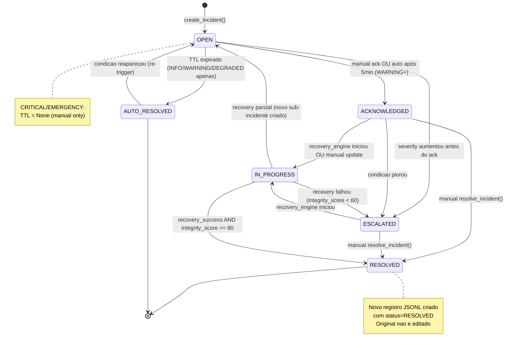

# Incident Management Flow — Phase R

> Document: `ai/docs/incident_management_flow.md`
> Phase: R — Autonomous Runtime Governance & Production Hardening
> Module: R-6 AutonomousIncidentManager
> Updated: 2026-05-17

---

## Visao Geral

O `AutonomousIncidentManager` (R-6) gerencia o ciclo de vida completo de incidentes
operacionais: criacao automatica por subsistemas, escalada baseada em severidade,
TTL para auto-resolucao de incidentes de baixa severidade, e integracao com o
`OperationalRecoveryEngine` (R-7) para incidentes criticos.

**Principio:** Incidentes de severidade CRITICAL e EMERGENCY nunca sao auto-resolvidos
por TTL. Requerem resolucao explicita ou recovery bem-sucedido.

---

## 1. Tabela de Severity Levels

| Severity | Nome | Valor Numerico | TTL | Auto-Resolve | Descricao |
|---|---|---|---|---|---|
| `INFO` | Informacional | 1 | 30 min | **Sim** | Evento de log sem impacto operacional. Ex: metricas fora do padrao por 1 ciclo |
| `WARNING` | Aviso | 2 | 60 min | **Sim** | Degradacao leve detectada. Ex: decay_rate elevado, latencia acima da media |
| `DEGRADED` | Degradado | 3 | 120 min | **Sim** | Servico operacional mas com capacidade reduzida. Ex: PARTIAL_RESTORE, watchdog anomalia |
| `CRITICAL` | Critico | 4 | **Manual** | **Nao** | Falha significativa afetando operacao. Ex: watchdog_triggered, recovery falhou |
| `EMERGENCY` | Emergencia | 5 | **Manual** | **Nao** | Falha grave que exige acao imediata. Ex: startup FAILED, recovery bloqueado 3x, deployment BLOCKED |

### Impacto no operational_risk_score por severity

```
INFO      → +2 pts no operational_risk_score por incidente ativo
WARNING   → +5 pts
DEGRADED  → +10 pts
CRITICAL  → +20 pts
EMERGENCY → +35 pts

operational_risk_score = sum(severidade × count) com cap de 100
```

---

## 2. Triggers de Criacao de Incidente (por Subsistema)

### R-1: AutonomousStartupManager

| Condicao | Severity | Mensagem Padrao |
|---|---|---|
| `startup_status = DEGRADED` | `WARNING` | "Startup completed in degraded mode: {details}" |
| `startup_status = FAILED` | `EMERGENCY` | "Startup failed: blocking checks not passed" |
| `subsystem_bootstrap_score < 60` | `DEGRADED` | "Multiple subsystems failed to bootstrap" |

### R-2: OperationalStateRestorationEngine

| Condicao | Severity | Mensagem Padrao |
|---|---|---|
| `restore_type = PARTIAL_RESTORE` | `WARNING` | "Partial state restoration: checksum mismatch" |
| `state_integrity_score < 50` | `DEGRADED` | "State integrity below threshold after restore" |
| `checksum_match = False` e estado recente | `CRITICAL` | "State corruption detected: checksum invalid for recent state" |

### R-3: AutonomousServiceWatchdog

| Condicao | Severity | Mensagem Padrao |
|---|---|---|
| `stalled_service_count >= 1` | `DEGRADED` | "Service stalled: {service_name}" |
| `deadlock_probability >= 0.5` | `CRITICAL` | "Potential deadlock detected: probability={value}" |
| `deadlock_probability >= 0.8` | `EMERGENCY` | "High-probability deadlock: immediate intervention needed" |
| `missing_heartbeat` por servico critico | `CRITICAL` | "Critical service heartbeat lost: {service_name}" |
| `watchdog_health_score < 40` | `CRITICAL` | "Watchdog health critical: {count} services impacted" |

### R-4: LongRunningStabilityEngine

| Condicao | Severity | Mensagem Padrao |
|---|---|---|
| `session_health < 0.65` | `WARNING` | "Session health degraded: {value}" |
| `decay_rate >= 0.05` | `WARNING` | "Performance decay rate elevated: {rate}/hour" |
| `stability_score < 50` | `DEGRADED` | "Session stability degraded: score={value}" |
| `stability_score < 30` | `CRITICAL` | "Critical stability decay: restart may be needed" |

### R-5: DeploymentSafetyValidator

| Condicao | Severity | Mensagem Padrao |
|---|---|---|
| `risk_level = CAUTION` | `WARNING` | "Deployment risk elevated: {risk_score}" |
| `risk_level = BLOCKED` | `EMERGENCY` | "Deployment blocked: risk_score={value} exceeds threshold" |
| Deploy manual apos BLOCKED | `CRITICAL` | "Forced deployment override: risk was BLOCKED" |

### R-7: OperationalRecoveryEngine

| Condicao | Severity | Mensagem Padrao |
|---|---|---|
| Recovery com `actions_completed < 50%` | `DEGRADED` | "Partial recovery: {n}/{total} actions completed" |
| Recovery com `integrity_score < 60` | `CRITICAL` | "Post-recovery integrity check failed: {score}" |
| Recovery blocked (3+ attempts/hour) | `EMERGENCY` | "Recovery rate limit hit: 3 attempts in 1 hour" |

### R-8: AutonomousRuntimeGovernance

| Condicao | Severity | Mensagem Padrao |
|---|---|---|
| `runtime_governance_score < 50` | `WARNING` | "Runtime governance score degraded: {score}" |
| `autonomous_runtime_approval = False` por 3+ ciclos | `DEGRADED` | "Runtime approval denied for {n} consecutive cycles" |
| `phases_failed >= 3` no ciclo | `CRITICAL` | "Multiple subsystems failed in governance cycle" |

---

## 3. Ciclo de Vida do Incidente



---

## 4. TTL por Severity

| Severity | TTL | Comportamento apos TTL |
|---|---|---|
| `INFO` | 30 minutos | Auto-resolved se condicao nao reapareceu |
| `WARNING` | 60 minutos | Auto-resolved se condicao nao reapareceu |
| `DEGRADED` | 120 minutos | Auto-resolved se condicao nao reapareceu |
| `CRITICAL` | **sem TTL** | Permanece ativo ate resolucao manual ou recovery bem-sucedido |
| `EMERGENCY` | **sem TTL** | Permanece ativo ate resolucao manual explicitamente confirmada |

**Regra de re-trigger:** Incidente auto-resolvido reabre automaticamente se a mesma
condicao for detectada novamente. Frequency score e incrementado a cada reabertura.

---

## 5. Formulas de Scoring de Incidentes

### severity_score (por incidente)

```
severity_score = severity_value × recency_weight × frequency_multiplier

severity_value:
  INFO=1, WARNING=2, DEGRADED=4, CRITICAL=8, EMERGENCY=15

recency_weight:
  age < 5min  → 1.0
  age < 15min → 0.9
  age < 30min → 0.75
  age < 60min → 0.60
  age > 60min → 0.40

frequency_multiplier:
  reaberturas == 0 → 1.0
  reaberturas == 1 → 1.2
  reaberturas == 2 → 1.4
  reaberturas >= 3 → 1.6
```

### frequency_score (por tipo de incidente)

```
frequency_score = incidentes_do_mesmo_tipo nas ultimas 60 min

Thresholds:
  < 2  → normal
  2-3  → elevated
  4-5  → high
  > 5  → flood (possivel loop de incidentes)
```

### operational_risk_score (agregado)

```
operational_risk_score = min(100,
  sum(severity_score × count_by_severity for each active_incident)
  + frequency_penalty
  + escalation_bonus
)

frequency_penalty: +5 se qualquer tipo com frequency_score > 3
escalation_bonus: +10 se qualquer incidente escalou nos ultimos 15 min
```

---

## 6. Regras de Auto-Resolucao

```
Auto-resolucao e permitida apenas se:
  1. severity IN {INFO, WARNING, DEGRADED}
  2. TTL expirado
  3. A condicao que gerou o incidente nao e mais detectada
     (avaliado no ciclo de governanca seguinte ao TTL)
  4. Nenhuma acao de recovery em andamento para este incidente

Auto-resolucao e BLOQUEADA se:
  - severity IN {CRITICAL, EMERGENCY}
  - recovery_engine esta IN_PROGRESS para este incidente
  - frequency_score >= 3 (possivel problema recorrente)
  - operational_risk_score >= 70 (momento critico geral)
```

---

## 7. Correlacao com Watchdog e Guardian

### Correlacao com R-3 (ServiceWatchdog)

```
Watchdog detecta servico travado
         │
         ▼
R-3.detect_stalled_loop(service_name)
         │
         ▼
R-6.create_incident(
    severity="DEGRADED" ou "CRITICAL",
    source="watchdog",
    description=f"Service stalled: {service_name}",
    correlation_id=watchdog_event_id
)
         │
         ▼
incident.status = OPEN
         │
         ├── [severity=DEGRADED] → aguarda TTL 120min
         │
         └── [severity=CRITICAL] → aciona R-7.run_recovery(trigger="WATCHDOG")
```

### Correlacao com Q-3 (AutonomousLiveGuardian — Phase Q)

```
Guardian detecta ROLLBACK
         │
         ▼
Q-7.AutonomousRollbackEngine.evaluate()
    → rollback_executed = True
         │
         ▼
R-6.create_incident(
    severity="CRITICAL",
    source="live_guardian",
    description=f"Live rollback executed: {trigger_type}",
    correlation_id=incident_id_from_Q7
)
```

---

## 8. Integracao com Recovery Engine (quando incidente aciona recovery)

```
Regras para acionar R-7 automaticamente:

  [TRIGGER_CONDITION]
  incidente.severity IN {CRITICAL, EMERGENCY}
  AND incidente.status = OPEN
  AND R-7.recovery_in_progress = False
  AND R-7.attempts_last_hour < 3

  [ACAO]
  R-7.run_recovery(
      trigger="INCIDENT",
      incident_id=incidente.incident_id,
      severity=incidente.severity
  )

  [POS-RECOVERY]
  se recovery_success AND integrity_score >= 80:
      R-6.resolve_incident(incident_id, reason="recovery_successful")
  se recovery falhou:
      R-6.escalate_incident(incident_id)  # se nao for EMERGENCY
      OU
      R-6.create_incident(severity="EMERGENCY", ...)  # se ja era CRITICAL
```

---

## 9. Schema JSON de um Incident Record

```json
{
  "incident_id": "INCIDENT-a1b2c3d4-e5f6-7890-abcd-ef1234567890",
  "severity": "CRITICAL",
  "severity_value": 4,
  "status": "OPEN",
  "source": "watchdog",
  "description": "Service stalled: live_execution_controller",
  "correlation_id": "WATCHDOG-xyz789",

  "created_at": "2026-05-17T14:32:11.123456+00:00",
  "acknowledged_at": null,
  "resolved_at": null,
  "ttl_minutes": null,
  "auto_resolve_eligible": false,

  "severity_score": 8.0,
  "frequency_score": 1,
  "reopen_count": 0,
  "escalated_from": null,

  "recovery_triggered": true,
  "recovery_id": "RECOVERY-xyz123",
  "recovery_outcome": null,

  "tags": ["watchdog", "stalled_service", "live_controller"],
  "metadata": {
    "service_name": "live_execution_controller",
    "stalled_duration_seconds": 47,
    "last_heartbeat": "2026-05-17T14:31:24.000000+00:00"
  },

  "resolution_reason": null,
  "resolved_by": null
}
```

---

## 10. Exemplos de Incidentes por Severity

### INFO — Exemplo

```json
{
  "incident_id": "INCIDENT-info-001",
  "severity": "INFO",
  "source": "stability_engine",
  "description": "decay_rate slightly elevated: 0.032/hour (threshold: 0.05)",
  "ttl_minutes": 30,
  "auto_resolve_eligible": true,
  "created_at": "2026-05-17T10:00:00+00:00"
}
```

### WARNING — Exemplo

```json
{
  "incident_id": "INCIDENT-warn-002",
  "severity": "WARNING",
  "source": "startup_manager",
  "description": "Startup completed in degraded mode: R-9 classifier failed to initialize",
  "ttl_minutes": 60,
  "auto_resolve_eligible": true,
  "metadata": { "failed_subsystem": "production_readiness_classifier", "startup_score": 68 }
}
```

### DEGRADED — Exemplo

```json
{
  "incident_id": "INCIDENT-deg-003",
  "severity": "DEGRADED",
  "source": "state_restoration",
  "description": "Partial state restoration: checksum mismatch on operational_state.json",
  "ttl_minutes": 120,
  "auto_resolve_eligible": true,
  "metadata": { "restore_type": "PARTIAL_RESTORE", "integrity_score": 62 }
}
```

### CRITICAL — Exemplo

```json
{
  "incident_id": "INCIDENT-crit-004",
  "severity": "CRITICAL",
  "source": "watchdog",
  "description": "High-probability deadlock detected: probability=0.72",
  "ttl_minutes": null,
  "auto_resolve_eligible": false,
  "recovery_triggered": true,
  "recovery_id": "RECOVERY-abc123",
  "metadata": { "deadlock_probability": 0.72, "services_involved": ["governance_loop", "incident_manager"] }
}
```

### EMERGENCY — Exemplo

```json
{
  "incident_id": "INCIDENT-emrg-005",
  "severity": "EMERGENCY",
  "source": "recovery_engine",
  "description": "Recovery rate limit hit: 3 failed attempts in last hour",
  "ttl_minutes": null,
  "auto_resolve_eligible": false,
  "recovery_triggered": false,
  "metadata": {
    "recovery_attempts_last_hour": 3,
    "last_recovery_id": "RECOVERY-def456",
    "trigger_history": ["WATCHDOG", "INCIDENT", "MANUAL"]
  }
}
```

---

## 11. CLIs Disponiveis

```bash
# Listar todos os incidentes ativos
python -m domains.crypto_coin.research.autonomous_incident_manager --list

# Listar com filtro por severity
python -m domains.crypto_coin.research.autonomous_incident_manager --list --severity CRITICAL

# Criar incidente manual
python -m domains.crypto_coin.research.autonomous_incident_manager \
  --create --severity WARNING --source manual \
  --description "Deploy cancelado por operador"

# Resolver incidente especifico
python -m domains.crypto_coin.research.autonomous_incident_manager \
  --resolve --id INCIDENT-crit-004 --reason "deadlock resolvido via recovery"

# Status geral (operational_risk_score + contagens por severity)
python -m domains.crypto_coin.research.autonomous_incident_manager --status

# Output JSON
python -m domains.crypto_coin.research.autonomous_incident_manager --json

# Historico completo
python -m domains.crypto_coin.research.autonomous_incident_manager --history --limit 50
```
