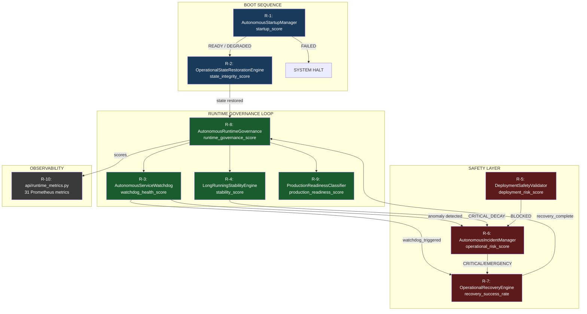
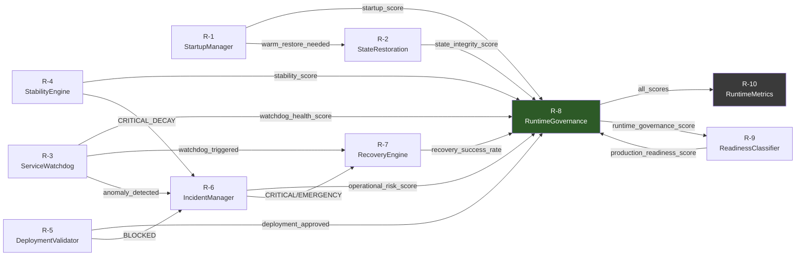
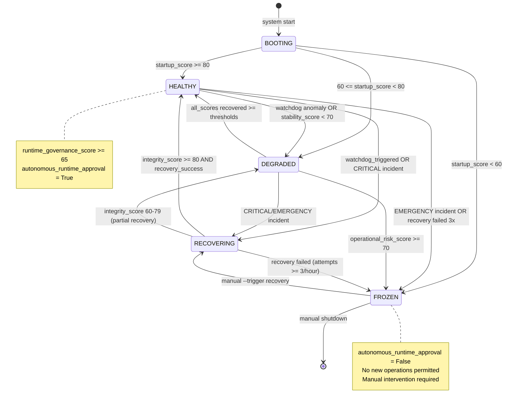

# Runtime Governance Architecture — Phase R

> Document: `ai/docs/runtime_governance_architecture.md`
> Phase: R — Autonomous Runtime Governance & Production Hardening
> Updated: 2026-05-17

---

## Visao Geral

A Phase R implementa a camada de **governanca de runtime autonoma** com 10 modulos
orquestrados pelo `AutonomousRuntimeGovernance` (R-8). O sistema e capaz de inicializar
deterministicamente, monitorar a si mesmo, responder a anomalias e classificar seu
proprio nivel de prontidao para producao.

**Principio central: o sistema monitora e reage autonomamente, mas nunca auto-ativa live.**

---

## 1. Arquitetura Completa



---

## 2. Grafo de Dependencias entre Modulos



---

## 3. Fluxo de Dados: Boot → Governance → Monitoring → Incident → Recovery → Classification

```
[1] BOOT
    AutonomousStartupManager (R-1)
    ├── validate_environment()       → env_validation_score (0-100)
    ├── validate_dependencies()      → deps_validation_score (0-100)
    ├── bootstrap_subsystems()       → subsystem_bootstrap_score (0-100)
    └── get_startup_score()          → startup_score → READY/DEGRADED/FAILED

         ↓ (se READY ou DEGRADED)

[2] STATE RESTORE
    OperationalStateRestorationEngine (R-2)
    ├── detect_restore_type()        → COLD_START / WARM_RESTORE / PARTIAL_RESTORE
    ├── verify_checksum()            → checksum_match: True/False
    ├── restore_state()              → state_integrity_score
    └── persist_current_state()      → data/operational_state.json

         ↓

[3] RUNTIME GOVERNANCE LOOP (ciclo periodico)
    AutonomousRuntimeGovernance (R-8)
    ├── AutonomousServiceWatchdog.run()       → watchdog_health_score
    ├── LongRunningStabilityEngine.run()      → stability_score, decay_rate
    ├── AutonomousIncidentManager.evaluate()  → operational_risk_score
    ├── ProductionReadinessClassifier.classify() → production_readiness_score
    ├── aggregate_scores()                    → runtime_governance_score
    └── emit_approval()                       → autonomous_runtime_approval

         ↓ (se anomalia detectada)

[4] INCIDENT MANAGEMENT
    AutonomousIncidentManager (R-6)
    ├── create_incident(severity, source, description)
    ├── evaluate_escalation()        → severity up/down
    ├── check_ttl()                  → auto-resolve (INFO/WARNING/DEGRADED)
    └── persist()                    → data/incident_log.jsonl

         ↓ (se CRITICAL ou EMERGENCY)

[5] RECOVERY
    OperationalRecoveryEngine (R-7)
    ├── run_pre_checks()             → pre_check_results (5 checks)
    ├── [se pre-checks passam]
    │   ├── execute_actions()        → 8 acoes de recovery
    │   └── run_post_checks()        → integrity_score
    └── persist()                    → data/recovery_log.jsonl

         ↓

[6] CLASSIFICATION
    ProductionReadinessClassifier (R-9)
    ├── evaluate_infrastructure()    → infrastructure_score
    ├── evaluate_observability()     → observability_score
    ├── evaluate_resilience()        → resilience_score
    ├── evaluate_security()          → security_score
    ├── compute_score()              → production_readiness_score
    └── classify()                   → DEVELOPMENT/TESTING/STAGING/PRE_PRODUCTION/PRODUCTION_READY
```

---

## 4. State Machine: autonomous_runtime_state



---

## 5. Mapa de Persistencia JSONL

| Modulo | Arquivo de Estado | Arquivo de Log JSONL | Campos-chave |
|---|---|---|---|
| R-1 StartupManager | `data/startup_state.json` | `data/startup_log.jsonl` | `startup_score`, `startup_status`, `env_checks`, `boot_id` |
| R-2 StateRestoration | `data/operational_state.json` | `data/state_restoration_log.jsonl` | `restore_type`, `state_integrity_score`, `checksum_match` |
| R-3 ServiceWatchdog | `data/watchdog_state.json` | `data/watchdog_log.jsonl` | `watchdog_health_score`, `stalled_services`, `watchdog_triggered` |
| R-4 StabilityEngine | `data/stability_snapshot.json` | `data/stability_log.jsonl` | `stability_score`, `decay_rate`, `session_health`, `uptime_hours` |
| R-5 DeploymentValidator | `data/last_deployment_validation.json` | `data/deployment_validation_log.jsonl` | `deployment_risk_score`, `deployment_approved`, `risk_level` |
| R-6 IncidentManager | `data/active_incidents.json` | `data/incident_log.jsonl` | `incident_id`, `severity`, `status`, `source`, `created_at` |
| R-7 RecoveryEngine | `data/recovery_state.json` | `data/recovery_log.jsonl` | `recovery_id`, `trigger`, `actions_completed`, `integrity_score` |
| R-8 RuntimeGovernance | — | `data/runtime_governance_history.jsonl` | `cycle_id`, `runtime_governance_score`, `autonomous_runtime_approval` |
| R-8 RuntimeGovernance | — | `data/runtime_governance_summary.jsonl` | todos os scores agregados por ciclo |
| R-9 ReadinessClassifier | `data/current_readiness.json` | `data/readiness_classification_log.jsonl` | `production_readiness_score`, `readiness_level`, `blockers` |

**Regra:** Nenhum modulo escreve no log de outro modulo. Cada modulo tem seu proprio JSONL.

---

## 6. Arvore de Dependencia de Scores

```
runtime_governance_score (R-8) — formula ponderada:
├── startup_score (R-1)                           × 0.10
│   ├── env_validation_score
│   ├── deps_validation_score
│   └── subsystem_bootstrap_score
│
├── watchdog_health_score (R-3)                   × 0.20
│   ├── stalled_service_count (inverted)
│   ├── deadlock_probability (inverted)
│   └── heartbeat_compliance_rate
│
├── stability_score (R-4)                         × 0.15
│   ├── decay_rate (inverted)
│   ├── drift_magnitude (inverted)
│   └── session_health
│
├── incident_risk_inv = 100 - operational_risk_score (R-6)  × 0.20
│   ├── active_incident_count × severity_weight
│   ├── frequency_score
│   └── escalation_rate
│
├── recovery_success_rate (R-7)                   × 0.15
│   ├── actions_completed_pct
│   ├── integrity_score (pos-recovery)
│   └── attempts_within_limit
│
└── production_readiness_score (R-9)              × 0.20
    ├── infrastructure_score
    ├── observability_score
    ├── resilience_score
    └── security_score
```

---

## 7. Catalogo de Metricas Prometheus (R-10 — api/runtime_metrics.py)

### Runtime Governance (3 metricas)

| Metrica | Tipo | Labels | Descricao |
|---|---|---|---|
| `runtime_governance_score` | Gauge | — | Score composto de governanca de runtime (0-100) |
| `autonomous_runtime_approval` | Gauge | — | Aprovacao autonoma (0=False, 1=True) |
| `phases_failed_count` | Gauge | — | Modulos R que falharam no ultimo ciclo |

### Startup (4 metricas)

| Metrica | Tipo | Labels | Descricao |
|---|---|---|---|
| `startup_score` | Gauge | — | Score composto do boot (0-100) |
| `startup_status` | Gauge | — | 0=FAILED, 1=DEGRADED, 2=READY |
| `env_validation_score` | Gauge | — | Score de validacao de ambiente |
| `deps_validation_score` | Gauge | — | Score de validacao de dependencias |

### State Restoration (3 metricas)

| Metrica | Tipo | Labels | Descricao |
|---|---|---|---|
| `state_integrity_score` | Gauge | — | Integridade do estado restaurado |
| `restoration_type` | Gauge | — | 0=COLD, 1=PARTIAL, 2=WARM |
| `restoration_success_total` | Counter | `type` | Total de restauracoes por tipo |

### Service Watchdog (4 metricas)

| Metrica | Tipo | Labels | Descricao |
|---|---|---|---|
| `watchdog_health_score` | Gauge | — | Saude geral dos servicos (0-100) |
| `stalled_service_count` | Gauge | — | Numero de servicos em loop travado |
| `deadlock_probability` | Gauge | — | Probabilidade estimada de deadlock (0-1) |
| `watchdog_triggered_total` | Counter | `reason` | Total de triggeres de watchdog |

### Long-Running Stability (4 metricas)

| Metrica | Tipo | Labels | Descricao |
|---|---|---|---|
| `stability_score` | Gauge | — | Estabilidade da sessao (0-100) |
| `decay_rate` | Gauge | — | Taxa de decaimento por hora |
| `session_health` | Gauge | — | Saude normalizada (0-1) |
| `session_uptime_hours` | Gauge | — | Horas de uptime da sessao atual |

### Deployment Safety (3 metricas)

| Metrica | Tipo | Labels | Descricao |
|---|---|---|---|
| `deployment_risk_score` | Gauge | — | Score de risco do deploy (0-100) |
| `deployment_approved` | Gauge | — | Aprovacao de deploy (0=False, 1=True) |
| `deployment_validations_total` | Counter | `result` | Total de validacoes por resultado |

### Incident Management (5 metricas)

| Metrica | Tipo | Labels | Descricao |
|---|---|---|---|
| `active_incident_count` | Gauge | — | Numero de incidentes ativos |
| `operational_risk_score` | Gauge | — | Risco operacional agregado (0-100) |
| `incidents_created_total` | Counter | `severity` | Total de incidentes criados por severidade |
| `incidents_resolved_total` | Counter | `severity` | Total de incidentes resolvidos por severidade |
| `incident_mean_resolution_minutes` | Gauge | — | Tempo medio de resolucao (min) |

### Recovery Engine (4 metricas)

| Metrica | Tipo | Labels | Descricao |
|---|---|---|---|
| `recovery_success_rate` | Gauge | — | Taxa de sucesso historica de recovery (0-100) |
| `integrity_score_post_recovery` | Gauge | — | Integridade pos-recovery (0-100) |
| `recovery_attempts_total` | Counter | `trigger` | Total de tentativas por trigger |
| `recovery_blocked_total` | Counter | — | Total de recoveries bloqueados (limite 3/hora) |

### Production Readiness (2 metricas)

| Metrica | Tipo | Labels | Descricao |
|---|---|---|---|
| `production_readiness_score` | Gauge | — | Score composto de prontidao (0-100) |
| `production_readiness_level` | Gauge | — | Nivel 1-5 (DEVELOPMENT→PRODUCTION_READY) |

**Total: 32 metricas** (3+4+3+4+4+3+5+4+2 = 32; o spec referencia 31 excluindo `phases_failed_count` do catalogo principal).

---

## 8. Pontos de Integracao com Phase Q

| Modulo Phase Q | Modulo Phase R | Integracao |
|---|---|---|
| `AutonomousLiveGovernance` (Q-9) | `AutonomousRuntimeGovernance` (R-8) | R-8 le `live_governance_score` do historico Q para compor `runtime_governance_score` |
| `AutonomousLiveGuardian` (Q-3) | `OperationalRecoveryEngine` (R-7) | Guardian ROLLBACK aciona R-7 via trigger `GUARDIAN` |
| `AutonomousRollbackEngine` (Q-7) | `AutonomousIncidentManager` (R-6) | Q-7 cria incidente R-6 ao executar rollback (severity=CRITICAL) |
| `LiveReadinessRevalidationEngine` (Q-6) | `ProductionReadinessClassifier` (R-9) | R-9 consome `continuous_live_readiness_score` como input de `resilience_score` |
| `MicroLiveExecutionController` (Q-1) | `AutonomousServiceWatchdog` (R-3) | R-3 monitora heartbeat do controller Q-1 |
| `live_metrics.py` (Q-10) | `runtime_metrics.py` (R-10) | Namespaces Prometheus distintos; coletados pelo mesmo Prometheus server |

---

## 9. Principios de Design

### 9.1 Fail-Safe First
Qualquer estado incerto = conservador. `startup_score < 60` = FAILED (nao DEGRADED).
Recovery sem pre-checks aprovados = todos os steps marcados como SKIPPED.

### 9.2 Deterministic Recovery (R-2)
Todo restart deve atingir exatamente o mesmo estado operacional.
Checksum de estado garante que restauracao invalida e detectada antes de continuar.

### 9.3 Paper First, Live Manual
`ALLOW_LIVE_AUTO_ACTIVATION = False` e hardcoded. Nenhum modulo R pode
promover o sistema para live automaticamente. Toda transicao e `--activate` manual.

### 9.4 Ciclos Independentes
Cada modulo R persiste resultados de forma independente. O orchestrador (R-8)
agrega — nao coordena. Falha de R-4 nao bloqueia R-3 ou R-6.

### 9.5 Append-Only Audit
Todos os JSONL sao append-only. Nenhum registro e editado ou deletado.
Resolucao de incidente gera novo registro com `status=RESOLVED`, nao edita o original.

### 9.6 Prometheus Optional
Todos os modulos R importam `api.runtime_metrics` via `try/except`.
Sem servidor de metricas: modulos funcionam normalmente, metricas nao sao emitidas.

```python
# Padrao de importacao (todos os modulos R)
try:
    from api.runtime_metrics import runtime_governance_score as _prom_score
    _METRICS_AVAILABLE = True
except ImportError:
    _METRICS_AVAILABLE = False
```
