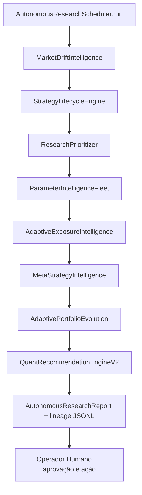
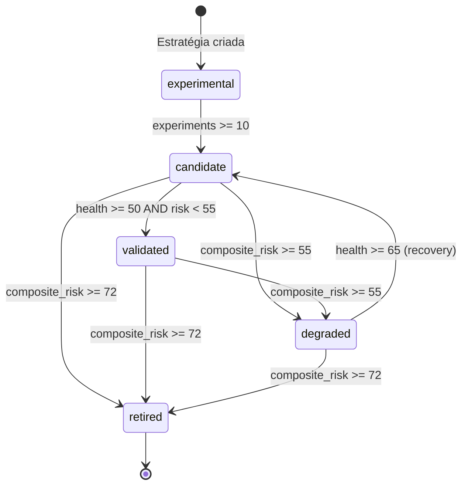
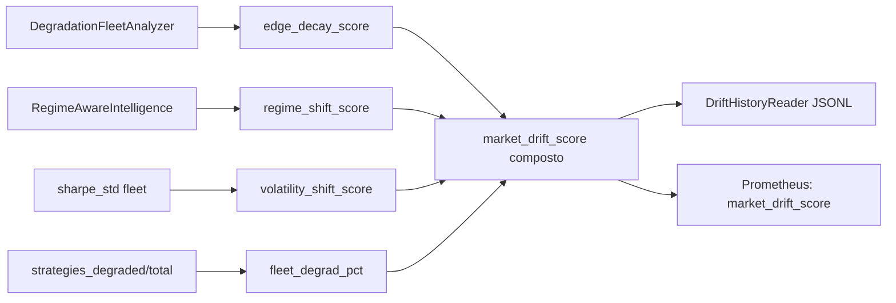
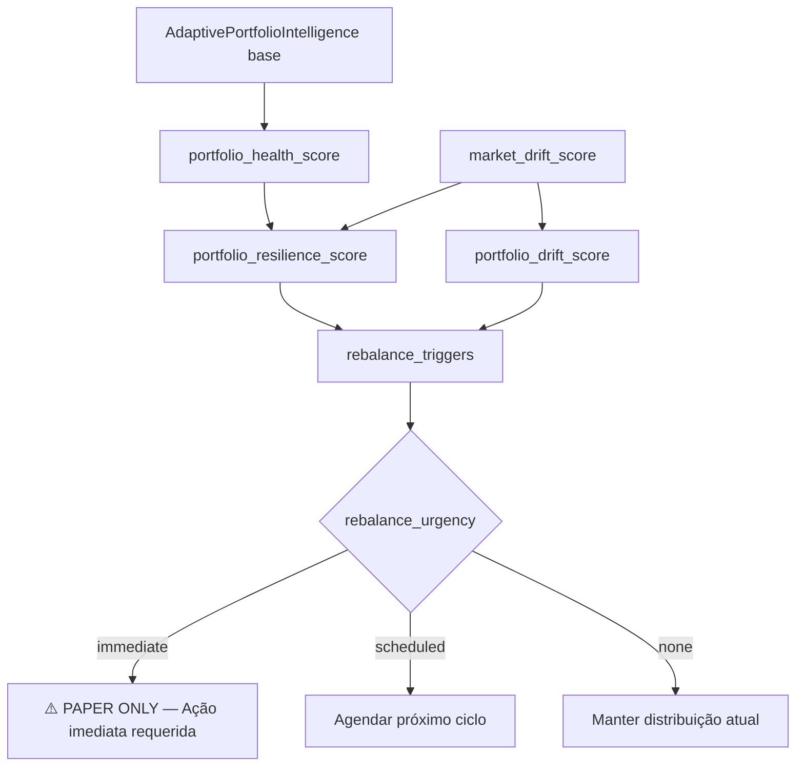

# Phase N Report — Autonomous Adaptive Quant Evolution

> Gerado: 2026-05-16
> Status: **COMPLETO**

---

## Objetivo

Transformar o sistema L5+ (Phase M) em uma **infraestrutura quantitativa adaptativa semi-autônoma**
capaz de:

- autoavaliar estratégias e portfólios continuamente
- detectar drift de mercado e degradação de edge
- gerenciar ciclo de vida adaptativo das estratégias
- adaptar exposição e allocation por regime, stress e lifecycle
- aprender relações entre estratégias (meta-inteligência)
- priorizar research automaticamente
- detectar parâmetros frágeis e sugerir evolução
- executar ciclos adaptativos completos com lineage

**Restrições mantidas**: Sem RL, LLM trading, previsão mágica, live trading agressivo ou decisões opacas.

---

## Arquivos Criados

| Arquivo | FASE | Descrição |
|---|---|---|
| `research/market_drift_intelligence.py` | 2 | Drift contínuo de mercado — 4 scores + histórico JSONL |
| `research/strategy_lifecycle.py` | 3 | Ciclo de vida de estratégias — 5 estados + transições com lineage |
| `research/adaptive_exposure_intelligence.py` | 4 | Exposição adaptativa por lifecycle, drift e regime |
| `research/meta_strategy_intelligence.py` | 5 | Meta-inteligência — correlação, hedge, sinergia de portfólio |
| `research/research_prioritizer.py` | 6 | Priorização autônoma de research — fila de tarefas |
| `research/parameter_intelligence.py` | 7 | Inteligência evolutiva de parâmetros — estabilidade + ranges |
| `research/autonomous_research_loop.py` | 10 | Loop autônomo semi-supervisionado — 8 fases, lineage, scheduling |

## Arquivos Modificados

| Arquivo | FASE | Mudança |
|---|---|---|
| `research/adaptive_quant_intelligence.py` | 8-9 | +`AdaptivePortfolioEvolution`, +`QuantRecommendationEngineV2` |
| `api/metrics.py` | 11 | +9 novas métricas Prometheus Phase N |
| `grafana/dashboards/crypto_autonomous_quant.json` | 12 | **NOVO** — 7 rows, 20 painéis |
| `ai/contexts/evolution_status.md` | 14 | L5+ → L6, +Phase N section |
| `ai/contexts/research_behavior_status.md` | 14 | +Phase N section |

---

## Fluxo do Loop Autônomo (FASE 10)



---

## Fluxo de Ciclo de Vida de Estratégias (FASE 3)



---

## Fluxo de Drift de Mercado (FASE 2)



---

## Fluxo de Portfolio Evolution (FASE 8)



---

## Novas Métricas Prometheus (9)

| Métrica | Tipo | Labels | Descrição |
|---|---|---|---|
| `market_drift_score` | Gauge | — | Drift composto de mercado 0–100 |
| `edge_decay_score` | Gauge | — | Decaimento de edge da frota 0–100 |
| `strategy_retirement_total` | Counter | strategy_id | Retiradas de estratégia |
| `strategy_promotions_total` | Counter | strategy_id | Promoções de estratégia |
| `adaptive_exposure_score` | Gauge | — | Exposição adaptativa média da frota 0–100 |
| `research_priority_score` | Gauge | — | Urgência de research da frota 0–100 |
| `parameter_stability_score` | Gauge | — | Estabilidade média de parâmetros 0–100 |
| `portfolio_resilience_score` | Gauge | — | Resiliência do portfólio 0–100 |
| `autonomous_recommendations_total` | Counter | type | Recomendações geradas pelo loop |

**Total acumulado Phase N**: 9 novas = **31 métricas Prometheus total** (6 Phase K + 8 Phase L + 6 Phase M + 9 Phase N + base)

---

## Scores Produzidos (Phase N)

### Drift Intelligence
| Score | Faixa | Origem |
|---|---|---|
| `market_drift_score` | 0–100 | `MarketDriftIntelligence` — composto drift |
| `edge_decay_score` | 0–100 | `MarketDriftIntelligence` — decaimento de edge |
| `regime_shift_score` | 0–100 | `MarketDriftIntelligence` — mudança de regime ótimo |
| `volatility_shift_score` | 0–100 | `MarketDriftIntelligence` — instabilidade de sharpe |

### Lifecycle Engine
| Score | Faixa | Origem |
|---|---|---|
| `lifecycle_state` | experimental→retired | `StrategyLifecycleEngine` |
| `promotion_score` | 0–100 | `StrategyLifecycleEngine` — prontidão para avançar |
| `retirement_score` | 0–100 | `StrategyLifecycleEngine` — urgência de retirada |
| `recovery_score` | 0–100 | `StrategyLifecycleEngine` — potencial de recovery |

### Adaptive Exposure
| Score | Faixa | Origem |
|---|---|---|
| `adaptive_exposure_score` | 0–100 | `AdaptiveExposureIntelligence` — exposição composta |
| `stress_exposure_score` | 0–100 | `AdaptiveExposureIntelligence` — penalidade por stress |
| `regime_exposure_score` | 0–100 | `AdaptiveExposureIntelligence` — qualidade por regime |
| `max_exposure_fraction` | 0.0–1.0 | `AdaptiveExposureIntelligence` — cap efetivo |

### Meta-Strategy
| Score | Faixa | Origem |
|---|---|---|
| `regime_correlation` | -1 a +1 | `MetaStrategyIntelligence` — Pearson por regime_sharpe |
| `hedge_compatibility_score` | 0–100 | `MetaStrategyIntelligence` — qualidade de hedge entre pares |
| `diversification_synergy_score` | 0–100 | `MetaStrategyIntelligence` — cobertura × low-corr |

### Research Prioritization
| Score | Faixa | Origem |
|---|---|---|
| `research_priority_score` | 0–100 | `ResearchPrioritizer` — urgência de research |
| `replay_priority_score` | 0–100 | `ResearchPrioritizer` — urgência de replay |
| `validation_priority_score` | 0–100 | `ResearchPrioritizer` — urgência de OOS validation |

### Parameter Intelligence
| Score | Faixa | Origem |
|---|---|---|
| `parameter_stability_score` | 0–100 | `ParameterIntelligence` — estabilidade média de parâmetros |
| `parameter_range_quality_score` | 0–100 | `ParameterIntelligence` — qualidade do range testado |
| `priority_for_sweep` | 0–100 | `ParameterIntelligence` — quão urgente swepar este parâmetro |

### Portfolio Evolution
| Score | Faixa | Origem |
|---|---|---|
| `portfolio_resilience_score` | 0–100 | `AdaptivePortfolioEvolution` — resistência a stress |
| `adaptive_diversification_score` | 0–100 | `AdaptivePortfolioEvolution` — diversificação pós-drift |
| `portfolio_drift_score` | 0–100 | `AdaptivePortfolioEvolution` — drift acumulado do portfólio |

---

## CLI Commands

```bash
# FASE 2 — Market Drift Intelligence
python -m domains.crypto_coin.research.market_drift_intelligence
python -m domains.crypto_coin.research.market_drift_intelligence --json
python -m domains.crypto_coin.research.market_drift_intelligence --trend --days 30

# FASE 3 — Strategy Lifecycle
python -m domains.crypto_coin.research.strategy_lifecycle --strategy trend_following
python -m domains.crypto_coin.research.strategy_lifecycle --all

# FASE 4 — Adaptive Exposure
python -m domains.crypto_coin.research.adaptive_exposure_intelligence --all --regime bull_market
python -m domains.crypto_coin.research.adaptive_exposure_intelligence --strategies trend_following breakout --json

# FASE 5 — Meta-Strategy Intelligence
python -m domains.crypto_coin.research.meta_strategy_intelligence --all --json
python -m domains.crypto_coin.research.meta_strategy_intelligence --strategies trend_following breakout

# FASE 6 — Research Prioritizer
python -m domains.crypto_coin.research.research_prioritizer --top 10
python -m domains.crypto_coin.research.research_prioritizer --json

# FASE 7 — Parameter Intelligence
python -m domains.crypto_coin.research.parameter_intelligence --strategy trend_following
python -m domains.crypto_coin.research.parameter_intelligence --all

# FASE 10 — Autonomous Research Loop
python -m domains.crypto_coin.research.autonomous_research_loop
python -m domains.crypto_coin.research.autonomous_research_loop --strategies trend_following breakout --json
python -m domains.crypto_coin.research.autonomous_research_loop --history --days 7
python -m domains.crypto_coin.research.autonomous_research_loop --regime bull_market
```

---

## Persistência de Dados (lineage)

| Arquivo | Módulo | Conteúdo |
|---|---|---|
| `data/drift_history.jsonl` | `MarketDriftIntelligence` | Histórico de drift por ciclo |
| `data/strategy_lifecycle.jsonl` | `StrategyLifecycleEngine` | Histórico de transições de lifecycle |
| `data/autonomous_loop_history.jsonl` | `AutonomousResearchScheduler` | Sumário de cada ciclo do loop |
| `data/experiments/{strategy}.jsonl` | `ExperimentTracker` (existente) | Experimentos de backtest/replay |

---

## Maturidade

| Domínio | Phase M | Phase N |
|---|---|---|
| Crypto Research Layer | L5+ (Adaptive Quant Intelligence) | **L6** (Autonomous Adaptive Quant Evolution) |

**L6 (Crypto Research Layer)**:
- Toda a infraestrutura L5+ mantida e complementada
- Ciclo de vida adaptativo de estratégias (experimental→retired)
- Drift intelligence contínuo com histórico temporal
- Exposure intelligence com lifecycle awareness
- Meta-strategy intelligence (correlação, hedge, sinergia)
- Research prioritization autônoma com fila de tarefas
- Parameter intelligence evolutiva (sem RL)
- Portfolio resilience + drift-aware rebalance
- Recommendation Engine v2 com todos os sinais integrados
- Loop semi-autônomo completo com lineage + 31 métricas Prometheus total

---

## Audit FASE 1 — O que existia antes do Phase N

| Camada | Existia | Status |
|---|---|---|
| replay infrastructure | `db_replay.py` | ✅ completo |
| orchestration | `research_orchestrator.py` | ✅ completo |
| degradation intelligence | `strategy_degradation_intelligence.py` | ✅ completo |
| fragility intelligence | `fragility_intelligence.py` | ✅ completo |
| regime intelligence | `regime_aware_intelligence.py` | ✅ completo |
| adaptive allocation | `adaptive_quant_intelligence.py` | ✅ paper only |
| portfolio intelligence | `adaptive_quant_intelligence.py` | ✅ completo |
| recommendation engine | `adaptive_quant_intelligence.py` | ✅ Phase M base |
| experiment lineage | `experiment_tracker.py` | ✅ completo |
| strategy ranker | `strategy_ranker.py` | ✅ completo |
| dataset intelligence | `dataset_intelligence.py` | ✅ completo |
| Prometheus (22 métricas) | `api/metrics.py` | ✅ completo |
| Grafana dashboards | `grafana/dashboards/` | ✅ 3 dashboards |
| **market drift** | — | ❌ gap → **criado FASE 2** |
| **strategy lifecycle** | — | ❌ gap → **criado FASE 3** |
| **exposure intelligence** | — | ❌ gap → **criado FASE 4** |
| **meta-strategy** | — | ❌ gap → **criado FASE 5** |
| **research prioritization** | — | ❌ gap → **criado FASE 6** |
| **parameter intelligence** | — | ❌ gap → **criado FASE 7** |
| **portfolio evolution** | — | ❌ gap → **criado FASE 8** |
| **autonomous loop** | `run_research_loop()` (básico) | ⚠️ parcial → **expandido FASE 10** |

---

## Restrições Mantidas

- ✅ Sem Reinforcement Learning
- ✅ Sem LLM para predição ou execução de trades
- ✅ Sem previsão mágica — tudo baseado em heurística quantitativa
- ✅ Sem live trading agressivo ou auto-execução
- ✅ Adaptive exposure é PAPER ONLY — requer aprovação humana
- ✅ Portfolio rebalance é PAPER ONLY — requer aprovação humana
- ✅ Sistema recomenda — operador decide
- ✅ Toda decisão é auditável, rastreável e reproduzível via lineage JSONL

---

## Riscos e Bottlenecks

| Risco | Mitigação |
|---|---|
| MarketDriftIntelligence usa experimentos como proxy de drift — não tem acesso a live market data | Documentado. Resultado é válido como indicador de edge decay, não como market feed. |
| StrategyLifecycleEngine pode transitar estratégia para `retired` com poucos dados | MIN threshold: composite_risk >= 72 só a partir de `candidate` ou `validated`. `experimental` não pode ser retired. |
| AutonomousResearchLoop falha em uma fase não para o ciclo | Cada fase usa try/except independente. Relatório reporta fases com falha. |
| Prometheus metrics opcionais (try/except import) | Funciona em CLI sem API server rodando. Métricas apenas emitidas quando API disponível. |
| `data/strategy_lifecycle.jsonl` cresce indefinidamente | P3 gap: implementar rotação/compactação de histórico antigo. |

---

## Gaps Pendentes (Phase O)

| Prioridade | Gap |
|---|---|
| P2 | Integrar MarketDriftIntelligence com OHLCV real (live feed ou normalized_market_candles) |
| P2 | Cron scheduling do autonomous research loop (semanal automático) |
| P2 | Compactação de arquivos JSONL de histórico (lifecycle, drift, loop) |
| P3 | Walk-forward validation integrada ao lifecycle (candidate→validated com OOS automático) |
| P3 | Alert rules Prometheus para market_drift_score >= 70 e portfolio_resilience < 40 |
| P3 | API endpoint para consultar autonomous loop history (FastAPI /research/loop/history) |
| P3 | Grafana provisioning automático do novo dashboard |
