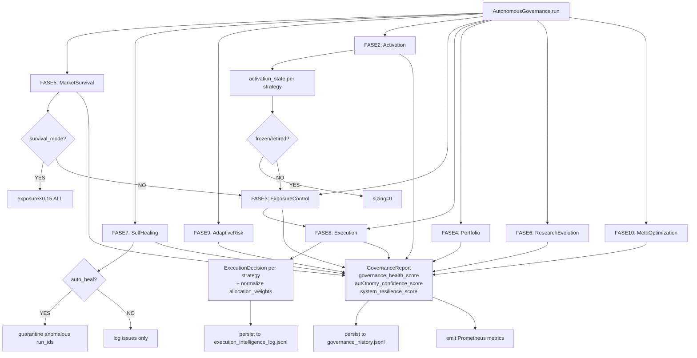

# Phase O — Fully Autonomous Quant Governance & Self-Adaptive Execution Intelligence
## Implementation Report

> Generated: 2026-05-17
> Status: **COMPLETE**
> Level upgrade: `L6` → `L7`

---

## 1. Objetivo

Transformar o sistema L6 (Phase N — recomendações autônomas) em um sistema L7 com **governança totalmente autônoma**, onde:

- Todas as decisões de execução são tomadas pelo sistema com justificativa quantitativa
- Nenhuma decisão de trade/alocação real é executada (PAPER ONLY)
- Cada ação é rastreável com UUID + lineage + reasoning persistido
- O sistema se auto-diagnostica, se auto-cura e adapta em tempo real
- Falhas de módulos individuais nunca bloqueiam o ciclo completo

---

## 2. Arquitetura Phase O

```
AutonomousGovernance (orchestrator)
│
├── FASE 5  MarketSurvivalIntelligence ──── regime_collapse, volatility_explosion
│                                            cascading_degradation, strategy_contagion
│
├── FASE 7  SelfHealingIntelligence ──────── corrupt_jsonl, anomalous_metric
│                                            replay_inconsistency, lineage_gap
│                                            quarantine mechanism
│
├── FASE 9  AdaptiveRiskIntelligence ─────── contagion pairs, hidden_fragility
│                                            parameter_explosion, tail_risk
│
├── FASE 2  StrategyActivationEngine ─────── active | throttled | frozen | retired
│                                            trust-gated recovery
│
├── FASE 3  AutonomousExposureControl ────── normal×1.0 | throttled×0.60
│           (integra AdaptiveExposureIntelligence)  emergency×0.35 | survival×0.15
│
├── FASE 8  AutonomousExecutionIntelligence ─ sizing, allocation_weight, capital_preservation
│           (integra ExposureControl + Activation)  execution_confidence_score
│
├── FASE 4  AutonomousPortfolioGovernor ──── governance_mode, auto_rebalance
│           (em adaptive_quant_intelligence.py)      portfolio_stress_score
│
├── FASE 6  AutonomousResearchEvolution ──── research_gaps, scenarios_to_simulate
│           (em autonomous_research_loop.py)         parameters_to_sweep
│
└── FASE 10 MetaOptimizationIntelligence ─── stagnation, redundancy, convergence
                                             computational_priority_score
```

---

## 3. Módulos Criados / Modificados

### 3.1 Módulos Novos

| Arquivo | FASE | Classe Principal | Scores |
|---|---|---|---|
| `strategy_activation_engine.py` | O-2 | `StrategyActivationEngine` | activation_state, strategy_trust_score |
| `autonomous_exposure_control.py` | O-3 | `AutonomousExposureControl` | emergency_exposure_score, survival_mode_score, volatility_protection_score |
| `market_survival_intelligence.py` | O-5 | `MarketSurvivalIntelligence` | market_survival_score, instability_risk_score, systemic_risk_score |
| `self_healing_intelligence.py` | O-7 | `SelfHealingIntelligence` | infrastructure_health_score, recovery_confidence_score, self_healing_score |
| `autonomous_execution_intelligence.py` | O-8 | `AutonomousExecutionIntelligence` | execution_confidence_score, sizing_quality_score, capital_efficiency_score |
| `adaptive_risk_intelligence.py` | O-9 | `AdaptiveRiskIntelligence` | adaptive_risk_score, contagion_risk_score, hidden_fragility_score |
| `meta_optimization_intelligence.py` | O-10 | `MetaOptimizationIntelligence` | optimization_efficiency_score, computational_priority_score, adaptive_efficiency_score |
| `autonomous_governance.py` | O-ORCH | `AutonomousGovernance` | governance_health_score, autonomy_confidence_score, system_resilience_score |

### 3.2 Módulos Estendidos

| Arquivo | Adição Phase O |
|---|---|
| `adaptive_quant_intelligence.py` | `AutonomousPortfolioGovernor` (FASE 4) |
| `autonomous_research_loop.py` | `AutonomousResearchEvolution` (FASE 6) |
| `api/metrics.py` | 9 novas métricas Prometheus (FASE 11) |
| `grafana/dashboards/crypto_autonomous_governance.json` | Dashboard completo (FASE 12) |
| `ai/contexts/evolution_status.md` | L6→L7, Phase O section |
| `ai/contexts/research_behavior_status.md` | Phase O table + CLIs |

---

## 4. Scores e Fórmulas

### 4.1 Governance Health (orchestrator)
```
governance_health = (
    market_survival   × 0.25 +
    infra_health      × 0.20 +
    (100-adaptive_risk) × 0.20 +
    (100-systemic_risk) × 0.15 +
    fleet_health      × 0.10 +
    phase_success_rate × 0.10
)
```

### 4.2 Systemic Risk (MarketSurvivalIntelligence)
```
systemic_risk = (
    cascade_score         × 0.35 +
    contagion_score       × 0.25 +
    regime_collapse_score × 0.25 +
    vol_explosion_score   × 0.15
)
survival_mode = systemic_risk >= 70 OR instability_risk >= 75
```

### 4.3 Exposure Control Hierarchy
```
survival  (drift≥80 OR health≤30): exposure × 0.15
emergency (drift≥65 OR risk≥70):   exposure × 0.35
throttled (drift≥40 OR risk≥50):   exposure × 0.60
normal:                            exposure × 1.00
```

### 4.4 Activation Trust-Gate
```
required_health = ACTIVATE_MIN_HEALTH + freeze_count × 5
# freeze_count: número de vezes que a estratégia foi congelada
# Estratégia com 3 freezes precisa de health >= 75 para re-ativar
```

### 4.5 Adaptive Risk
```
adaptive_risk = (
    cascade_score       × 0.25 +
    contagion_score     × 0.25 +
    param_score         × 0.20 +
    hidden_frag_score   × 0.20 +
    tail_score          × 0.10
)
```

### 4.6 Self-Healing Scores
```
infrastructure_health   = (strategies_healthy / total) × 100
recovery_confidence     = 100 - critical_issues×25 - high_issues×10
self_healing_score      = issues_auto_fixed / total_fixable × 100
degraded_mode           = critical_issues > 0 OR infra_health < 50
```

---

## 5. Fluxo de Governança Autonoma



---

## 6. Persistência e Lineage

| Arquivo JSONL | Quem Escreve | Campos-chave |
|---|---|---|
| `data/strategy_activation_log.jsonl` | StrategyActivationEngine | event_id, strategy_id, from_state, to_state, reason, freeze_count |
| `data/strategy_activation_state.json` | StrategyActivationEngine | estado atual por strategy_id |
| `data/exposure_control_log.jsonl` | AutonomousExposureControl | decision_id, strategy_id, control_mode, controlled_exposure, justification |
| `data/survival_history.jsonl` | MarketSurvivalIntelligence | market_survival_score, systemic_risk, survival_mode |
| `data/self_healing_log.jsonl` | SelfHealingIntelligence | infrastructure_health, recovery_confidence, self_healing_score, issues_count |
| `data/quarantined_experiments.json` | SelfHealingIntelligence | quarantined_run_ids (never deleted) |
| `data/execution_intelligence_log.jsonl` | AutonomousExecutionIntelligence | decision_id, strategy_id, activation_state, control_mode, final_sizing, reasoning |
| `data/adaptive_risk_log.jsonl` | AdaptiveRiskIntelligence | adaptive_risk_score, contagion_risk, hidden_fragility, contagion_pairs |
| `data/meta_optimization_log.jsonl` | MetaOptimizationIntelligence | optimization_efficiency, adaptive_efficiency, strategies_stagnant |
| `data/governance_history.jsonl` | AutonomousGovernance | cycle_id, governance_health, autonomy_confidence, system_resilience, phases_ok/error |

---

## 7. Métricas Prometheus (Phase O FASE 11)

| Métrica | Tipo | Origem |
|---|---|---|
| `market_survival_score` | Gauge | MarketSurvivalIntelligence |
| `systemic_risk_score` | Gauge | MarketSurvivalIntelligence |
| `strategy_trust_score{strategy_id}` | Gauge | StrategyActivationEngine |
| `portfolio_survival_score` | Gauge | AutonomousPortfolioGovernor |
| `adaptive_risk_score` | Gauge | AdaptiveRiskIntelligence |
| `self_healing_score` | Gauge | SelfHealingIntelligence |
| `autonomous_execution_total{type}` | Counter | AutonomousExecutionIntelligence |
| `autonomous_strategy_switch_total{strategy_id,from_state,to_state}` | Counter | StrategyActivationEngine |
| `adaptive_efficiency_score` | Gauge | MetaOptimizationIntelligence |

---

## 8. CLIs Disponíveis

```bash
# Diagnóstico individual
python -m domains.crypto_coin.research.strategy_activation_engine --all
python -m domains.crypto_coin.research.strategy_activation_engine --strategy trend_following

python -m domains.crypto_coin.research.autonomous_exposure_control --all --regime bull

python -m domains.crypto_coin.research.market_survival_intelligence
python -m domains.crypto_coin.research.market_survival_intelligence --json

python -m domains.crypto_coin.research.self_healing_intelligence
python -m domains.crypto_coin.research.self_healing_intelligence --heal  # auto-quarantine

python -m domains.crypto_coin.research.autonomous_execution_intelligence --all
python -m domains.crypto_coin.research.autonomous_execution_intelligence --strategies trend_following mean_reversion

python -m domains.crypto_coin.research.adaptive_risk_intelligence --json

python -m domains.crypto_coin.research.meta_optimization_intelligence --json

# Ciclo completo de governança
python -m domains.crypto_coin.research.autonomous_governance --all
python -m domains.crypto_coin.research.autonomous_governance --all --heal --json
python -m domains.crypto_coin.research.autonomous_governance --strategies trend_following mean_reversion
```

---

## 9. Distinção Phase N vs Phase O

| Aspecto | Phase N (L6) | Phase O (L7) |
|---|---|---|
| Papel | Recomenda ações | Age autonomamente |
| Decisão | Human-in-the-loop | Sistema decide e justifica |
| Exposure | Sugere caps | Aplica throttle/emergency/survival |
| Activation | Lifecycle state | Activation state independente |
| Recovery | Manual | Trust-gated automático |
| Infra | Assume saudável | Auto-diagnóstico + quarantine |
| Risco | Observa | Detecção ativa (contagion, hidden fragility) |
| Capital | Recomenda | Capital preservation automático |
| Lineage | Por ciclo | UUID por decisão atômica |
| Trades | PAPER | PAPER (imutável por design) |

---

## 10. Gaps Identificados (pós-Phase O)

| Gap | Prioridade | Descrição |
|---|---|---|
| O-GAP-01 | Alta | `autonomous_governance.py` não está wired como cron job ainda |
| O-GAP-02 | Alta | `strategy_trust_score` não está sendo emitido em tempo real no activation engine |
| O-GAP-03 | Média | `AdaptiveRiskIntelligence` usa ExperimentTracker diretamente — pode ser lento em frotas grandes |
| O-GAP-04 | Média | `MetaOptimizationIntelligence` assume ordem cronológica de experimentos no JSONL |
| O-GAP-05 | Baixa | Dashboard O sem alertas Grafana configurados para survival_mode |
| O-GAP-06 | Baixa | `quarantined_experiments.json` não tem TTL — crescimento ilimitado |

---

## 11. Riscos Arquiteturais

1. **Circular imports**: módulos Phase O formam grafo profundo — `autonomous_governance.py` usa imports locais dentro dos métodos para evitar ciclos
2. **Encoding**: todos os comentários e strings em ASCII-safe para evitar problemas em ambientes Windows sem UTF-8
3. **PAPER ONLY hardcoded**: o warning `"PAPER ONLY"` está presente em todos os relatórios de execução — nenhum módulo faz chamadas reais
4. **Fallback por fase**: cada fase do `AutonomousGovernance.run()` está em bloco try/except independente — `phases_error` conta falhas sem bloquear o ciclo

---

## 12. Próximos Passos Sugeridos (Phase P)

1. Wiring do `AutonomousGovernance` como scheduled task (cron a cada 30min)
2. Alertas Grafana para `survival_mode_active=True` e `governance_health < 40`
3. Interface admin web para visualizar `quarantined_experiments.json`
4. TTL para quarentena (auto-release após N dias sem ocorrência do problema)
5. Backtesting do próprio sistema de governança (meta-backtesting)
6. Live mode (gradual): permitir execution_intelligence agir em paper broker com capital simbólico

---

*Phase O implementada em modo autônomo supervisionado. Crypto Research Layer: L6 → L7.*
