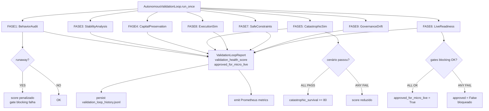

# Phase P — Autonomous Quant Validation & Micro-Live Readiness
## Implementation Report

> Generated: 2026-05-17
> Status: **COMPLETE**
> Level upgrade: `L7` → `L8`

---

## 1. Objetivo

Construir a camada de **validação autônoma profunda** e preparar o sistema para **micro-live controlado**:

- Validar comportamento emergente do sistema Phase O
- Detectar instabilidade, runaway behavior e deriva de governança
- Validar mecanismos de preservação de capital sob condições adversas
- Simular cenários catastróficos e verificar reações corretas
- Implementar constraints de segurança autônomos para micro-live
- Simular microestrutura de mercado real (slippage, fills, latência)
- Criar gate formal de aprovação para micro-live

**O objetivo NÃO é maximizar lucro — é sobrevivência, estabilidade e validação operacional.**

---

## 2. Arquitetura Phase P

```
AutonomousValidationLoop (FASE 10 — orchestrator de validação)
│
├── FASE 1  AutonomousBehaviorAuditor ────── runaway detection, gov loop, obs gaps
│                                            allocation instability, exposure drift
│
├── FASE 3  AutonomousStabilityIntelligence ─ oscillating allocation, unstable exposure
│                                              excessive switching, recursive degradation
│
├── FASE 4  CapitalPreservationValidator ──── 5 checks formais: trigger, reduction,
│                                             survival_mode, frozen_zero, drawdown
│
├── FASE 5  CatastrophicSimulationEngine ──── 6 cenários: flash_crash, cascading_vol,
│                                             liquidity_collapse, prolonged_bear,
│                                             regime_instability, multi_strategy_degrad
│
├── FASE 7  SafeAutonomousConstraints ─────── max_capital(80%), max_daily_loss(5%),
│                                             max_per_strategy(35%), emergency_contraction
│                                             UUID por violação → lineage completo
│
├── FASE 8  ExecutionSimulationEngine ─────── Monte Carlo × 4 regimes:
│                                             slippage, spread, fill_rate, latency, fees
│
├── FASE 9  GovernanceDriftIntelligence ───── overreaction, underreaction,
│                                             excessive_adaptation, delayed_adaptation
│
└── FASE 6  MicroLiveReadinessEngine ─────── 8 gates (6 blocking):
            (avaliado por último)              aprovação formal para micro-live
```

---

## 3. Módulos Criados

| Arquivo | FASE | Classe Principal | Scores |
|---|---|---|---|
| `autonomous_behavior_audit.py` | P-1 | `AutonomousBehaviorAuditor` | system_autonomy_score, runaway_risk_score, operational_stability_score |
| `autonomous_stability_intelligence.py` | P-3 | `AutonomousStabilityIntelligence` | autonomy_stability_score, allocation_stability_score, governance_consistency_score |
| `capital_preservation_validator.py` | P-4 | `CapitalPreservationValidator` | capital_survival_score, preservation_efficiency_score, drawdown_protection_score |
| `catastrophic_simulation_engine.py` | P-5 | `CatastrophicSimulationEngine` | catastrophic_survival_score, autonomous_reaction_score |
| `micro_live_readiness_engine.py` | P-6 | `MicroLiveReadinessEngine` | live_readiness_score, execution_reliability_score, slippage_quality_score |
| `safe_autonomous_constraints.py` | P-7 | `SafeAutonomousConstraints` | all_constraints_passed, emergency_contraction, max_allowed_total_exposure |
| `execution_simulation_engine.py` | P-8 | `ExecutionSimulationEngine` | execution_realism_score, fill_quality_score, latency_impact_score |
| `governance_drift_intelligence.py` | P-9 | `GovernanceDriftIntelligence` | governance_drift_score, adaptation_quality_score, autonomous_balance_score |
| `autonomous_validation_loop.py` | P-10 | `AutonomousValidationLoop` | validation_health_score, live_readiness_score, approved_for_micro_live |

---

## 4. Gates de Aprovação — Micro-Live

```
Gate                          Blocking  Critério
─────────────────────────────────────────────────────────────────────
governance_cycles             YES       >= 3 ciclos de governance
execution_decisions           YES       >= 5 decisões de execução
no_runaway_behavior           YES       runaway_detected = False
governance_stable             YES       governance_looping = False
autonomy_stability            YES       autonomy_stability_score >= 60
capital_preservation_validated YES      capital_survival_score >= 65
catastrophic_scenarios        NO        >= 4 cenários catastróficos passados
observability_logs            NO        logs presentes e populados
```

**Aprovação formal:** todos os 6 gates blocking devem passar.

---

## 5. Cenários Catastróficos

| Cenário | Drift | Health | Systemic Risk | Modo Esperado |
|---|---|---|---|---|
| `flash_crash` | 90 | 20 | 85 | survival |
| `cascading_volatility` | 75 | 35 | 70 | emergency |
| `liquidity_collapse` | 70 | 40 | 65 | emergency |
| `prolonged_bear` | 65 | 30 | 60 | emergency |
| `regime_instability` | 80 | 45 | 72 | survival |
| `multi_strategy_degradation` | 60 | 25 | 78 | emergency |

Reações verificadas por cenário:
1. `survival_mode` ativado quando systemic_risk >= 70
2. `capital_preservation` ativado quando drift >= 65
3. `control_mode` emergency ou survival (não normal)
4. `exposure_level` <= 35% quando fleet_health <= 35

---

## 6. Parâmetros de Microestrutura (ExecutionSimulationEngine)

| Regime | Slippage (bps) | Spread (bps) | Fill Rate | Latência (ms) |
|---|---|---|---|---|
| low_vol | 2.0 ± 1.0 | 1.5 ± 0.5 | 95% full | 80 ± 20 |
| medium_vol | 5.0 ± 2.5 | 3.0 ± 1.0 | 88% full | 150 ± 50 |
| high_vol | 15.0 ± 8.0 | 8.0 ± 3.0 | 72% full | 350 ± 150 |
| crisis | 40.0 ± 20.0 | 25.0 ± 12.0 | 45% full | 1200 ± 500 |

**Custo total = slippage + spread/2 + fee (10bps taker / 2bps maker)**

Viável para micro-live se custo médio < 30bps.

---

## 7. Safe Constraints — Limites Automáticos

| Constraint | Limite | Fator de Redução |
|---|---|---|
| max_total_capital_allocation | 80% | 50% quando violado |
| max_daily_loss | -5% | parada automática |
| max_per_strategy | 35% | 50% quando violado |
| max_corr_exposure | 50% | 50% quando violado |
| emergency_contraction | systemic_risk >= 70 | 80% (exposure × 0.20) |

Cada violação gera `ConstraintViolation` com UUID, justificativa quantitativa e ação.

---

## 8. Fluxo de Validação Completo



---

## 9. Métricas Prometheus (Phase P FASE 11)

| Métrica | Tipo | Origem |
|---|---|---|
| `autonomy_stability_score` | Gauge | AutonomousStabilityIntelligence |
| `capital_survival_score` | Gauge | CapitalPreservationValidator |
| `live_readiness_score` | Gauge | MicroLiveReadinessEngine |
| `governance_drift_score` | Gauge | GovernanceDriftIntelligence |
| `execution_realism_score` | Gauge | ExecutionSimulationEngine |
| `preservation_efficiency_score` | Gauge | CapitalPreservationValidator |
| `autonomous_validation_cycles_total{status}` | Counter | AutonomousValidationLoop |
| `catastrophic_scenarios_total{scenario}` | Counter | CatastrophicSimulationEngine |
| `emergency_contractions_total{type}` | Counter | SafeAutonomousConstraints |

---

## 10. Persistência

| Arquivo | Quem Escreve | Campos-chave |
|---|---|---|
| `data/behavior_audit_log.jsonl` | AutonomousBehaviorAuditor | system_autonomy_score, runaway_detected, gov_looping |
| `data/stability_intelligence_log.jsonl` | AutonomousStabilityIntelligence | autonomy_stability_score, allocation_oscillating |
| `data/capital_preservation_log.jsonl` | CapitalPreservationValidator | capital_survival_score, checks_passed |
| `data/catastrophic_simulation_log.jsonl` | CatastrophicSimulationEngine | scenario_name, reaction_score, control_mode, passed |
| `data/live_readiness_log.jsonl` | MicroLiveReadinessEngine | live_readiness_score, approved, blocking_failures |
| `data/safe_constraints_log.jsonl` | SafeAutonomousConstraints | violations_count, emergency_contraction |
| `data/execution_simulation_log.jsonl` | ExecutionSimulationEngine | avg_cost_bps, avg_fill_rate, feasible_for_micro_live |
| `data/governance_drift_log.jsonl` | GovernanceDriftIntelligence | governance_drift_score, overreaction, underreaction |
| `data/validation_loop_history.jsonl` | AutonomousValidationLoop | cycle_id, validation_health_score, approved_for_micro_live |

---

## 11. Distinção Phase O vs Phase P

| Aspecto | Phase O (L7) | Phase P (L8) |
|---|---|---|
| Foco | Governança autônoma | Validação profunda |
| Decisões | Agem em tempo real | Avaliam o avaliador |
| Cenários | Dados reais | Simulação sintética |
| Gates | Não existem | 8 gates formais para micro-live |
| Execução | Paper sizing | Monte Carlo microestrutura |
| Constraints | Exposição controlada | Limite hard automático |
| Meta-análise | Não | Audit do próprio comportamento |
| Drift | De mercado | Da própria governança |

---

## 12. Gaps Identificados (pós-Phase P)

| Gap | Prioridade | Descrição |
|---|---|---|
| P-GAP-01 | Alta | `AutonomousValidationLoop` não está wired como scheduled task (cron) |
| P-GAP-02 | Alta | `ExecutionSimulationEngine` sem calibração real de Binance — parâmetros estimados |
| P-GAP-03 | Média | Cenários catastróficos usam inputs sintéticos — não usa dados históricos de crash reais |
| P-GAP-04 | Média | `SafeAutonomousConstraints` sem integração real com PnL — usa valor zero como default |
| P-GAP-05 | Média | Alertas Grafana não configurados para `live_readiness < 50` e `emergency_contractions > 0` |
| P-GAP-06 | Baixa | `MicroLiveReadinessEngine` com slippage_quality_score fixo (60.0) até ter dados reais |

---

## 13. Próximos Passos — Phase Q (sugestão)

1. **Integração com exchange real** (read-only): Binance Testnet para validar latência real
2. **Micro-live paper com capital simbólico** ($50-200): coleta de slippage/fill reais
3. **Calibração de ExecutionSimulationEngine**: ajustar parâmetros com dados reais coletados
4. **Automação do ValidationLoop**: cron a cada 30min com alertas Grafana
5. **Dashboard de Micro-Live**: painel dedicado com dados em tempo real de fills e slippage

---

## 14. Maturidade Quantitativa Atual

```
L1  Dados brutos
L2  Pipeline funcional
L3  Analytics + Prometheus
L4  Research + backtesting
L5  Intelligence layer
L6  Autonomous recommendations
L7  Autonomous governance (Phase O)
L8  Autonomous validation + micro-live readiness (Phase P) ← ATUAL
```

O sistema está pronto para a primeira iteração de micro-live controlado após aprovação formal pelo `MicroLiveReadinessEngine`.

---

*Phase P implementada em modo autônomo supervisionado. Crypto Research Layer: L7 → L8.*
